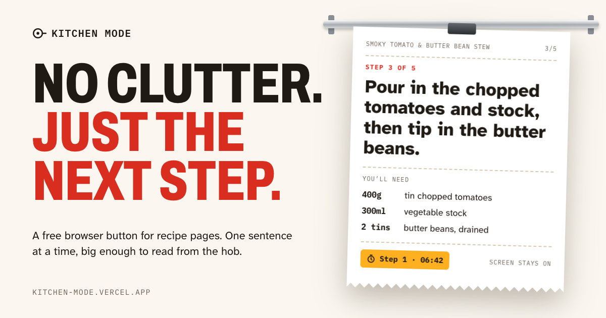

# Kitchen Mode

A free browser button that turns a recipe page into big, step-by-step instructions you can read from across the kitchen.

**Live:** https://kitchen-mode.vercel.app · **Try it on a sample recipe:** https://kitchen-mode.vercel.app/#try



## What it does

Click the bookmark on a recipe page and you get:

- the ingredients to tick off, then each step one sentence at a time, in type sized to be read from a distance
- a "You'll need" panel showing only the ingredients the current sentence mentions
- tap-to-start timers on any time in the text ("cook for 8–10 mins" starts an 8-minute timer)
- the screen kept awake while it's open
- keyboard, tap, swipe, foot pedal or presentation clicker to move through the steps

It runs in the browser. Each time it opens it sends one anonymous count: the site's name, whether it found a recipe, and which build it is. Never the page address, the recipe or anything about you (see [Usage counts](#usage-counts)).

## How it works

Recipe sites publish a structured copy of each recipe ([schema.org Recipe](https://schema.org/Recipe) JSON-LD) so Google can show rich results. Kitchen Mode reads that instead of the page layout, which is why ads, pop-ups and long introductions never get in the way, and why it works on any site that publishes the data.

- Steps are split into sentences; very short sentences ride along with the one before.
- Ingredients are matched to sentences by their distinctive words ("hot chicken stock" matches on *chicken* and *stock*), ignoring words shared by several ingredients.
- Times are found with a regex; ranges start the timer at the low end, so you check early rather than late.
- The view is mounted in a shadow DOM, so the recipe site's CSS can't interfere.
- The screen stays on through the Screen Wake Lock API, re-requested when the tab becomes visible again.

## Files

| File | What it is |
|---|---|
| `kitchen-mode.js` | Readable source of the bookmarklet. Edit this one. |
| `build.mjs` | Builds `index.html`: strips comments, turns the source into a `javascript:` URL, and writes the landing page with the sample recipe. Also writes `km.js`. `HANDLE`, `SITE_URL` and `POSTHOG_KEY` are set at the top. |
| `km.js` | Generated. The same code as a file, loaded by the short phone bookmark. Don't edit by hand. |
| `vercel.json` | Forwards `/relay/*` to PostHog's EU servers, so ad blockers that block posthog.com don't drop the counts. |
| `index.html` | The generated landing page. Don't edit by hand. |
| `og.png` | Link preview image (1200×630) used by X and others. |
| `og-image.html` | Source for `og.png`. |

## Working on it

```sh
node build.mjs     # rebuild index.html and km.js after changing kitchen-mode.js or build.mjs
open index.html    # "Try it on a sample recipe" runs the current code; index.html#test is the test recipe
```

Regenerate the preview image after changing `og-image.html`:

```sh
"/Applications/Google Chrome.app/Contents/MacOS/Google Chrome" --headless=new --hide-scrollbars \
  --virtual-time-budget=4000 --window-size=1200,630 --screenshot="$PWD/og.png" "file://$PWD/og-image.html"
```

Deploy (static files, no build step on Vercel):

```sh
vercel deploy --prod
```

## Usage counts

Two free tools, neither using cookies:

- **Vercel Web Analytics** counts landing page visits, where they came from, countries and devices (the project's Analytics tab).
- **PostHog** (project "Analytics", EU region, set to discard IP addresses) gets these events through `/relay/` on this site. Each name starts with `kitchen_mode_`.

| Event | Sent when | Properties |
|---|---|---|
| `page_viewed` | the landing page loads | `from`: the referring site |
| `tried` | "Try it" is pressed, or the page opens at `#try` | |
| `button_clicked` | someone clicks the install button instead of dragging it | |
| `drag_started` | the install button is picked up | |
| `drag_ended` | it's let go | `effect`: `none` if the drag was cancelled; anything else means it landed, most likely on the bookmarks bar |
| `code_copied` | "Copy the code" worked (phone setup) | |
| `test_opened` | the test recipe (`#test`) opens, from the last setup step | |
| `test_passed` | a bookmark opened Kitchen Mode on the test recipe ("Try it" doesn't count) | `loader`: whether it was the phone bookmark |
| `opened` | the bookmarklet opens, on any site | `site`, `found` (whether it found a recipe), `build` (build date), `loader` (whether the phone bookmark loaded it from `km.js`) |

The landing page events share one random ID per visit, so they work as a funnel. `opened` gets a new random ID every time, so it counts opens, not people.

Limits: copies installed before 27 Sep 2026 never report, since installed copies don't update (phone bookmarks set up since then load `km.js`, so they always run the current build). Sites whose security policy blocks outside requests drop the count silently. `opened` on kitchen-mode.vercel.app is "Try it". Nothing is sent when the page is opened from a file.

## Site support

Checked on 27 Sep 2026 by loading a recipe page and running the same data lookup the bookmarklet uses. Sites that turn away plain requests were loaded in headless Chrome instead.

- **Publish the data (73 sites):** the list, with the recipe checked on each, lives in `tested` in `build.mjs`. The 12 names in `featured` show on the landing page; the rest sit behind "N more sites".
- **Don't publish usable data:** Nigella, Mary Berry, Smitten Kitchen, Hairy Bikers, Rick Stein and Inspired Taste publish none; Gordon Ramsay publishes recipes without their steps
- **Blocked even headless Chrome** (bot protection, so unknown rather than unsupported): Taste of Home, The Kitchn, The Woks of Life, Riverford, Coles
- **No recipe page found to check:** EatingWell, Skinnytaste, Tesco Real Food, Donna Hay, Ambitious Kitchen (the crawl only reached collection pages)
- **Left off the landing page on purpose:** NYT Cooking publishes the data, but the recipes are paywalled. Big non-English sites (Marmiton, Chefkoch, Cookpad) weren't checked, since the sentence and timer rules are written for English.

## Decisions

- **A bookmarklet rather than an extension.** No install, store fee or review, and nothing leaves the page but an anonymous count. The costs: it's desktop-first, phone setup means pasting code into a bookmark by hand, and bookmarks dragged on a computer never update, so test before sharing a new version.
- **Phones get a short loader bookmark; computers keep the full code.** The first phone users couldn't get the 34 KB bookmark to run: 8 "Copy the code" presses on 27 Sep and no phone opens. So phones now paste a 224-character bookmark that loads `km.js` from this site. It's short enough to check by eye, it always runs the current build, and if the script can't load it says so instead of doing nothing. The cost: each open fetches `km.js` from this site (Vercel's default `max-age=0, must-revalidate`, so a quick revalidation), and sites whose security policy only allows scripts from listed hosts would block it (none of the 50 listed sites that answered a plain request do). Computers keep the full-code drag, which works; switching them too would bring updates to everyone.
- **Setup ends with a test.** The last phone step opens the test recipe (`#test`), which puts the sample recipe on the page and shows a banner saying what to do, then "It works" once a bookmark opens it. People find out at once, with the steps still in front of them. Android steps name the bookmark `kitchenmode` so it's the only address-bar match: the landing page's title is also "Kitchen Mode", and the history entry for it outranks the bookmark. Chrome on Android does nothing when a code bookmark is tapped in the bookmarks list and only runs it from an address-bar suggestion, so the last Android step and the test banner say so. The first real Android test, on 27 Sep 2026, tried the bookmarks menu first. Touch screens (including tablets, whose Chrome sends a desktop user agent) get only the phone steps, since links can't be dragged to a bookmarks bar there.
- **The grip dots, tear line and pan on the install button are drawn by CSS**, so the dragged bookmark is named plain "Kitchen Mode". Chrome always shows its own globe icon for bookmarklets and there's no way to set a different one.
- **The sample recipe's JSON-LD is only added when someone presses "Try it"**, so Google never reads the landing page as a recipe.
- **Landing page design: "The Pass".** Each recipe step is an order ticket clipped to the steel rail at a restaurant pass. The bookmarks bar is the rail, and installing means hanging the Kitchen Mode ticket on it. Cream ground, white tickets with a clip and drop shadow, tomato red (#d92d20) for actions, amber (#ffb020) for timers, espresso bands; steel is the only cool colour. Fonts are Archivo condensed for headings, IBM Plex Mono for labels and Atkinson Hyperlegible Next for body text (legibility is the point of the tool). The hero ticket plays through a step the way the real view does. Every text and background pair is at least 4.5:1, or 3:1 for text 24px and up, in light and dark mode.
- **The tool's palette matches the landing page:** cream background, tomato red for the step counter, progress and buttons, amber chips for running timers with a light amber tint on tappable times, and "You'll need" and the finish screen as white ticket stubs. Labels (title bar, eyebrows, pills, timers, the serves and cooking-time line, key hints) use the system monospace font; the step text and headings are system-ui. Buttons match the landing page: 10px corners, red with a darker red shadow, or an ink outline. There are no web fonts in the tool, because they're unreliable on other sites' pages, and nothing is rotated or torn, because reading comes first. Ringing timers turn red, so the "screen may sleep" warning is an inverted ink pill instead. Dimmed sentences sit at 50–55% opacity so they still reach 3:1.
- **The tool was restyled before launch, not after**, because installed bookmarklets never update: whatever look ships first is the one early users keep. It also means the ticket on the landing page shows what people actually get.
- **Name:** kept "Kitchen Mode" because it says what it does. "Recipease" was considered and dropped: it was Jamie Oliver's cookery shop brand, and it sounds identical to "recipes".

## Not yet tested

- The phone setup steps on a real iPhone (Safari). Checked on 27 Sep 2026 in headless Chrome emulating an Android phone and tablet, with the bookmark run the way the browser runs one: the phone bookmark loads `km.js` and opens the test recipe, "It works" shows for a bookmark but not for "Try it", tapping again closes it, and a failed load shows its message. Checked the same day on a real Android phone (Chrome): typing `kitchenmode` in the address bar and tapping the suggestion with the star opens the test recipe, and tapping the bookmark in the bookmarks menu does nothing. Not checked: anything on iOS.
- Real click tests on most sites in the list above. The phone bookmark was run the same way on 16 (the 12 featured, plus Budget Bytes, Delish, Minimalist Baker and Pinch of Yum) and opened with the recipe on all of them, including BBC Food despite its strict security policy. The rest have only had the data check.
- The landing page and cook view in Safari and Firefox (the redesign was checked in Chrome only)
- Whether any browser reports a drop on the bookmarks bar as anything but `none` in `drag_ended`: all 11 drags on 27 Sep 2026 reported `none`, so it may not tell a landed drop from a cancelled one even in Chrome

## Ideas

- A mobile web version: paste a recipe link and get the cook view (needs a small server function, since browsers can't read other sites' pages), with shareable links per recipe
- Scale servings ("serves 4" to 2), rewriting quantities including fractions
- Read the current step aloud, and voice "next"
- Give computers the loader bookmark too, so updates reach everyone
- A shopping list merged from several recipe links

---

Made by [@richyjudge](https://x.com/richyjudge).
